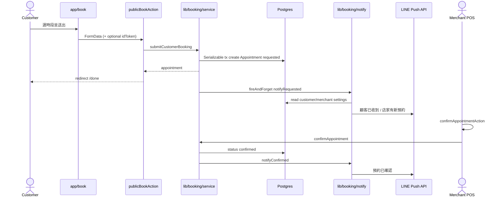
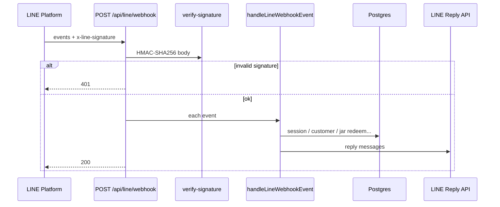
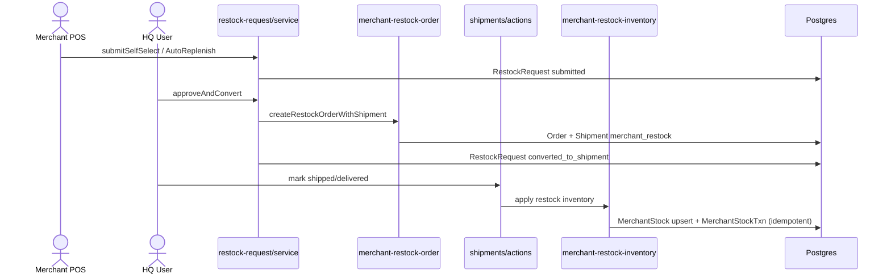

# API and Data Flow

**依據：** `app/api/**`, `app/**/actions.ts`, `middleware.ts`

---

## 1. Route Handlers（`app/api`）

| Method / Path | Auth | 服務 | 讀寫 | 外部 | Idempotent | 備註 |
|---------------|------|------|------|------|------------|------|
| `POST /api/auth/logout` | Cookie clear | auth | cookie | — | 是 | |
| `GET\|POST /api/cron/expire-coupons` | Bearer `CRON_SECRET` | coupons expire | GroomingCoupon | — | 大致是 | 未設 secret 時僅 development 放行 |
| `GET\|POST /api/cron/maintain-shipments` | 同上 | sync／ensure／KPI／booking reminders | 多表 | LINE push | 提醒靠 DB 時間戳 | Hobby 每日 |
| `POST /api/line/webhook` | HMAC `x-line-signature` | `handleLineWebhookEvent` | Customer／Jar／Session… | LINE Reply | 事件級待確認 | |
| `GET /api/line/webhook` | 無 | health | — | — | 是 | |
| `POST /api/line/liff/me` | LINE idToken | LIFF dashboard | Customer／points | LINE verify | 是 | |
| `POST /api/line/liff/register` | idToken | 註冊／更新 | Customer | LINE verify | 部分 | |
| `POST /api/line/liff/redeem` | idToken | 兑獎 | points／redemption | LINE verify | 需業務冪等 | |
| `POST /api/coupons` | 無 session；storeId slug | verify／redeem coupon | GroomingCoupon | — | redeem 後不可再兑 | middleware 放行 |
| `GET\|POST /api/admin/ensure-zhuwo` | HQ `getCurrentUser` | ensure merchants | Merchant／Store | — | 大致是 | |
| `GET /api/notifications/new-orders` | HQ session (middleware) | poll orders | Order | — | 是 | |
| `POST /api/notifications/subscribe` | HQ | upsert push | UserPushSubscription | — | upsert | |
| `POST /api/notifications/unsubscribe` | HQ | delete | UserPushSubscription | — | 是 | |
| `GET /api/notifications/vapid-public-key` | middleware HQ | 回傳公鑰 | — | — | 是 | handler 內未再驗 |
| `GET /api/jar-exchange/codes/pdf` | middleware HQ | PDF labels | JarCode | — | 是 | `all=1` 可大量 |

**錯誤：** 多為 JSON `{ ok:false, error }` 或 HTTP 401／400／500；部分 500 回傳 `e.message`。

---

## 2. Server Actions（精選）

| 位置 | 角色 | 代表動作 | 表 |
|------|------|----------|-----|
| `app/login/actions.ts` | 公開 | HQ login | User |
| `app/book/actions.ts` | 公開 | publicBookAction | Appointment, Customer |
| `app/pos/login/actions.ts` | 公開 | POS login | MerchantUser |
| `app/pos/appointments/actions.ts` | Merchant | confirm／reschedule／cancel／create／schedule | Appointment, MerchantSettings |
| `app/pos/restock/actions.ts` | Merchant | 自己選／幫我配 | RestockRequest |
| `app/(main)/restock-requests/actions.ts` | HQ（顯式 requireHqUser） | approve／reject | RestockRequest, Shipment |
| `app/(main)/orders/actions.ts` | HQ（middleware） | CRUD／狀態 | Order |
| `app/(main)/shipments/actions.ts` | HQ | 出貨狀態／入庫副作用 | Shipment, MerchantStock* |
| `app/(main)/jar-exchange/actions.ts` | HQ | 序號／點數／獎勵 | Jar* |
| `app/(main)/merchants/[id]/actions.ts` | HQ | 庫存／銷售／設定 | MerchantStock* |
| 其他 `app/(main)/**/actions.ts` | HQ | 客戶／商品／結算／訂閱／任務 | 各自主檔 |

**角色限制：** POS 用 `requireMerchantSession`；多數 HQ 僅 middleware session，**未**依 `User.role` 細分（例外：restock-requests 有 `requireHqUser`）。

---

## 3. 重複付款／扣庫存／通知風險

| 風險 | 現況 | 依據 |
|------|------|------|
| 重複付款 | 無金流 webhook；Order.paymentStatus 人工／表單 | 無 ECPay code |
| 重複扣／入庫 | merchant_restock 以 txn note 冪等 | `merchant-restock-inventory.ts` |
| 重複 Restock Shipment | shipmentId unique + approve claim | restock service |
| 重複預約 | Serializable tx | booking service |
| 重複 LINE 通知 | `lineNotify*At`／`lineReminder*At` | booking notify／reminders |
| 重複兑碼 | JarCode status 轉換（transaction） | redeem-code |

---

## 4. Sequence — 顧客預約（主要使用者流程）

---

## 5. Sequence — Webhook（LINE；非付款）

> 付款 webhook：**未實作**。以下為現行 LINE webhook。

---

## 6. Sequence — 叫貨與入庫（庫存／預約相關）

---

## 7. 認證需求速查

| 區域 | 機制 |
|------|------|
| `/pos/*`（除 login） | merchant JWT |
| `/ (main)/*` | HQ JWT |
| `/book/*`, `/liff/*` | 公開／LIFF token |
| `/api/line/*` | signature 或 idToken |
| `/api/cron/*` | CRON_SECRET |
| `/api/coupons` | storeId 驗證 |
