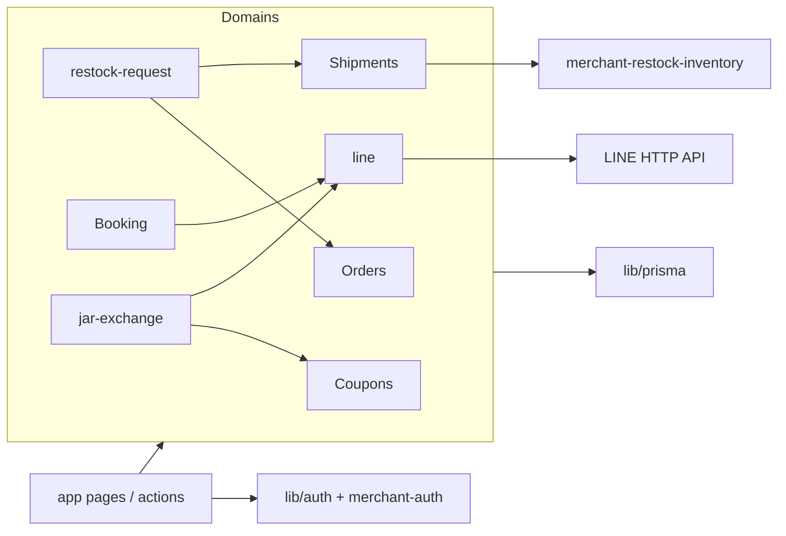
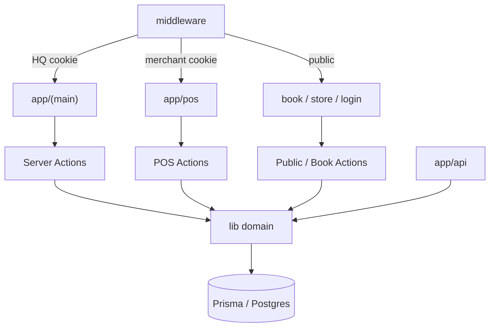

# Furmosa Architecture

**依據：** `package.json`, `next.config.mjs`, `middleware.ts`, `app/`, `lib/`, `features/`

---

## 1. 框架與版本

| 項目 | 版本／設定 | 路徑 |
|------|------------|------|
| Next.js | ^14.2.15 App Router | `package.json` |
| React | ^18.3.1 | `package.json` |
| TypeScript | ^5.6.2 | `tsconfig.json` |
| Prisma | ^5.20 / client 5.x | `package.json`, `prisma/schema.prisma` |
| Tailwind | ^3.4 | `tailwind.config.ts` |
| jose / bcryptjs | JWT + 密碼 | `lib/auth.ts` |

`next.config.mjs`：`reactStrictMode`, Prisma external package, `optimizePackageImports`, Server Actions body 2mb, `/supply*` → jar-exchange redirects。

---

## 2. 架構模式

- **Modular monolith**：單一 deployable；領域邏輯集中在 `lib/<domain>/`，UI 在 `app/` + `components/`。  
- **Server-first：** 預設 React Server Components；互動表單用 `'use client'` + Server Actions（`'use server'`）。  
- **双 Session 閘道：** Edge middleware 分離 HQ／POS（`middleware.ts`）。  
- **字串狀態機：** 多數「enum」以 String + `lib/labels.ts`／domain constants 約束，非 Prisma Enum。

---

## 3. 主要模組及職責

| 模組 | 職責 | 主要路徑 |
|------|------|----------|
| HQ Auth | 員工登入、JWT cookie | `lib/auth.ts`, `lib/auth-edge.ts`, `app/login/` |
| Merchant Auth | POS 登入、隔離 | `lib/merchant-auth/*`, `app/pos/login/` |
| Orders | 建單／狀態／搜尋 | `app/(main)/orders/*`, `lib/orders/*` |
| Shipments | 出貨佇列／狀態／與訂單同步 | `app/(main)/shipments/*`, `lib/shipment*.ts`, `lib/shipment-order-sync.ts` |
| Merchants / Stock | 寄賣店、庫存異動、結算 UI | `app/(main)/merchants/*`, `lib/merchant-*.ts` |
| RestockRequest | 店家叫貨 → HQ 核准 → Shipment | `lib/restock-request/*`, `app/pos/restock/*`, `app/(main)/restock-requests/*` |
| Booking | 班表、預約、公開頁、LINE 通知 | `lib/booking/*`, `app/pos/appointments/*`, `app/book/*` |
| Jar Exchange | 序號、點數、兑獎、營收訂單 | `lib/jar-exchange/*`, `app/(main)/jar-exchange/*` |
| LINE | Webhook、選單、註冊、Push／Reply | `lib/line/*`, `app/api/line/*` |
| Coupons | 美容券發行／核銷 | `lib/coupons/*`, `app/api/coupons/route.ts` |
| Dashboard | KPI、今日任務、快取 | `features/dashboard/queries.ts`, `lib/dashboard-kpi-snapshot.ts` |
| Cron | 券過期、維護、提醒、KPI | `app/api/cron/*` |
| Web Push | HQ 訂閱與新訂單 | `lib/web-push.ts`, `app/api/notifications/*` |

---

## 4. 模組依賴關係（概念）

---

## 5. 共用元件／hooks／services／utilities

| 類型 | 路徑 | 說明 |
|------|------|------|
| UI primitives | `components/ui/*` | shadcn |
| Layout | `components/layout/*` | Sidebar、搜尋 |
| POS shell | `components/pos/*` | 底部導航 |
| LIFF hooks | `components/liff/use-liff.ts` | LIFF init |
| 分頁 | `lib/list-pagination.ts`, `components/shared/list-pagination.tsx` | 訂單／出貨 |
| 虛擬列表 | `components/shared/virtualized-rows.tsx` | `@tanstack/react-virtual` |
| 快取 | `lib/runtime-cache.ts`, `lib/cache-tags.ts`, `lib/hot-path-reads.ts` | Runtime + unstable_cache |
| 節流 | `lib/job-throttle.ts` | process-local |
| 標籤／狀態文案 | `lib/labels.ts` | HQ 狀態字串 |
| 台北日曆 | `lib/taipei-date.ts` | Dashboard／提醒 |
| 格式化 | `lib/format.ts`, `lib/utils.ts` | — |

**Zustand：** 依賴存在於 `package.json`；實際業務 store 使用情況 **待確認**（未作為主要伺服器狀態方案）。

---

## 6. Server / Client boundary

| 邊界 | 規則 | 證據 |
|------|------|------|
| Server Components | 頁面預設 async 讀 Prisma | 多數 `app/**/page.tsx` |
| Client Components | `'use client'` 表單／互動 | 例如 `app/book/.../book-form.tsx`, POS forms |
| Server Actions | `'use server'` 在 `actions.ts` | `app/**/actions.ts`（約 20+） |
| Route Handlers | `app/api/**/route.ts` | LINE、cron、coupons… |
| Edge | middleware + `*-edge.ts` JWT verify | `middleware.ts`, `lib/auth-edge.ts`, `lib/merchant-auth/edge.ts` |

**勿**在 Client 直接使用 Prisma 或含 secrets 的模組。

---

## 7. 狀態管理

- **伺服器狀態：** DB 為 SSOT；頁面重讀／`revalidatePath`（actions 內常見）。  
- **Session 狀態：** JWT cookies。  
- **Client 表單狀態：** `useFormState` / react-hook-form（部分大型表單如 `order-form.tsx`）。  
- **LINE 對話狀態：** `LineChatSession` / `LineMenuState` 表。

---

## 8. 快取方式

| 機制 | 路徑 | 用途 |
|------|------|------|
| Vercel Runtime Cache + memory fallback | `lib/runtime-cache.ts` | Dashboard／熱路徑 |
| `unstable_cache` | `features/dashboard/queries.ts`, `lib/hot-path-reads.ts` | 標籤失效 |
| Cache tags | `lib/cache-tags.ts` | bust on mutation |
| Dashboard KPI snapshot 表 | `DashboardKpiSnapshot`, cron refresh | 預聚合 |
| LINE throttle | `lib/line/*-throttle.ts` | 24h 選單／觸發冷卻 |

---

## 9. 錯誤處理

- Server Actions：回傳 `{ error?: string }` 或 throw；`isNextRedirect` 區分 redirect（`lib/is-next-redirect.ts`）。  
- API routes：`NextResponse.json` + HTTP status；部分 catch 回傳 `e.message`（見 Security）。  
- LINE／booking notify：失敗 **不回滾** 主交易，console.error（`lib/booking/notify.ts`）。  
- Prisma 連線：`lib/auth.ts` 對 DB unreachable 有特化訊息。

---

## 10. Logging

- 主要：`console.error` / `console.log`（cron、LINE、notify）。  
- **無**集中式 APM／結構化 logger 套件（待確認是否僅靠 Vercel logs）。

---

## 11. Mermaid — 模組關係（部署視角）

