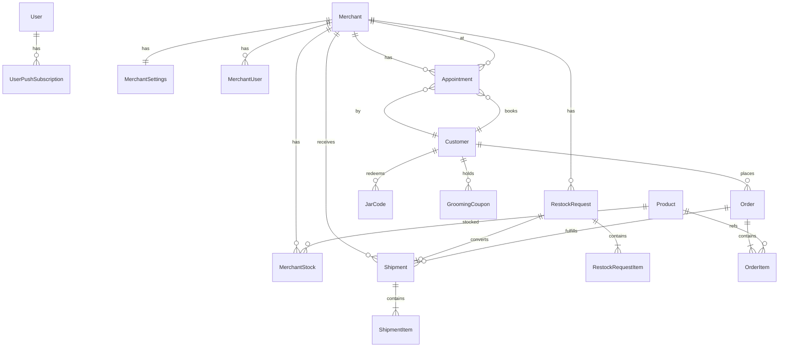

# Furmosa Database

**ORM：** Prisma 5  
**DB：** PostgreSQL（Supabase）— `prisma/schema.prisma`  
**連線：** `DATABASE_URL`（pooler 6543）+ `DIRECT_URL`（5432 migrate）  
**禁止：** 本文件階段不執行 migration／reset。

> README 仍提 SQLite — **過時**；以 schema `provider = "postgresql"` 為準。

---

## 1. 主要資料表（分組）

### 身分／營運
| 表（model） | PK | 重點欄位 | 備註 |
|-------------|----|----------|------|
| `User` | cuid | email@unique, role, passwordHash | HQ 員工 |
| `UserPushSubscription` | cuid | endpoint@unique | Web Push |
| `MerchantUser` | cuid | username@unique, passwordHash, merchantId | POS |
| `Merchant` | cuid | merchantId@unique, commissionRate, status | 寄賣店 |
| `MerchantSettings` | cuid | merchantId@unique, booking*, bookingNotifyLineUserId | 1:1 |

### 主檔
| 表 | 重點 |
|----|------|
| `Vendor`, `Product`, `ProductPriceTier`, `Warehouse` | 供應／SKU／多規格價／倉 |
| `Customer` | 個資、LINE、寵物、累計消費 |
| `Store` | 合作店 slug／secretToken（核銷） |

### 交易／物流
| 表 | 重點 |
|----|------|
| `Order`, `OrderItem` | 來源／狀態／付款／出貨分離 |
| `Shipment`, `ShipmentItem` | type: merchant_restock／customer_order／subscription |
| `RestockRequest`, `RestockRequestItem` | 店家叫貨 |
| `Subscription*`, `Settlement` | 訂閱與月結 |
| `MerchantStock`, `MerchantStockTxn` | 寄賣庫存與流水 |
| `InventoryBalance`, `InventoryTransaction` | HQ 多倉（寫入路徑待確認） |

### 換罐／點數／券
| 表 | 重點 |
|----|------|
| `JarCode` | code@unique, status unused／used |
| `MemberPointsLedger` | 點數流水 |
| `RewardCatalog`, `RewardRedemption`, `MarketingCostRecord` | 兑獎與成本 |
| `GroomingCoupon` | 美容折價券 |
| `CustomerService` | personal／subscription／jar_exchange |

### Booking／LINE 狀態
| 表 | 重點 |
|----|------|
| `Appointment` | status, capacity 相關, LINE 冪等時間戳 |
| `LineChatSession`, `LineMenuState` | 對話／節流 |
| `DashboardKpiSnapshot` | id=`default` 預聚合 JSON |

合法狀態字串見 `lib/labels.ts` 與各 domain `constants.ts`（**非** Prisma Enum）。

---

## 2. 關鍵關係（摘要）

- Merchant 1—* MerchantUser, Settings, Stock, RestockRequest, Appointment, Settlement  
- Customer 1—* Order, Appointment, JarCode(redeem), Coupons, Subscriptions  
- RestockRequest 0..1 Shipment（shipmentId@unique）  
- Order 1—* Shipment（可選）  
- Appointment → Merchant **Cascade**, Customer **Restrict**, Product? **SetNull**  

完整 onDelete：見 schema；Cascade／Restrict／SetNull 混用。

---

## 3. 唯一限制（精選）

| 唯一 | 意義 |
|------|------|
| User.email, MerchantUser.username | 登入帳號 |
| JarCode.code, GroomingCoupon.couponCode | 防重複券／碼 |
| RestockRequest.shipmentId | 一申請一出貨 |
| MerchantStock (merchantId, productId, tierId) | 庫存列 |
| CustomerService (customerId, serviceType) | 服務類型不重複 |
| DashboardKpiSnapshot.id | 單列快照 |

---

## 4. 「Enum」關鍵值（應用層）

| 領域 | 值來源 |
|------|--------|
| Appointment.status | `lib/booking/constants.ts` |
| RestockRequest.status / requestType | `lib/restock-request/constants.ts` |
| Shipment.status / type | `lib/shipment.ts`, schema 註解 |
| Order.status / payment / fulfillment | `lib/labels.ts` |
| JarCode.status | unused／used／expired（schema 註解） |
| User.role | admin／staff／finance／warehouse |

---

## 5. Transaction 使用

| 模式 | 位置 | 用途 |
|------|------|------|
| **Serializable** | `lib/booking/service.ts` 建立預約 | 防容量競態 |
| 預設 `$transaction` | restock approve、jar redeem、coupon issue、LINE bind、訂單／出貨 actions 等 | 原子多表寫入 |

PgBouncer transaction mode：長事務／Serializable 需注意（部署用 pooler）— 營運風險 **待確認監控**。

---

## 6. Migration 狀態

- 目錄：`prisma/migrations/`（lock：`migration_lock.toml` provider postgresql）  
- 近期：`20260722100000_merchant_user` → restock → booking → `dashboard_kpi_snapshot` → `booking_line_notify`  
- `package.json` `build` 含對 `20260722110000_qimu_delivery_address` 的 resolve workaround  
- **本階段不執行** `migrate deploy`／`reset`

---

## 7. 刪除策略

- **無 soft delete**（無 deletedAt 模式）。  
- 終態用 status（cancelled／expired／closed）。  
- FK：重要交易列多 **Restrict**（如 Appointment→Customer、OrderItem→Product）；設定類多 **Cascade**。

---

## 8. 個資與敏感資料位置

| 資料 | 表／欄位 |
|------|----------|
| 姓名／電話／Email／地址 | `Customer`, Order／Shipment recipient*, Subscription recipient* |
| 密碼雜湊 | `User.passwordHash`, `MerchantUser.passwordHash` |
| LINE User ID／顯示名 | `Customer.lineUserId`, `lineDisplay`；MerchantSettings.bookingNotifyLineUserId |
| 生日／性別／寵物 | `Customer.*` |
| Push 金鑰 | `UserPushSubscription` p256dh／auth |
| Store secret | `Store.secretToken`（用途待確認是否仍使用） |

**文件與 log 禁止輸出明文個資／密碼／token。**

---

## 9. 可能問題（靜態）

| 問題 | 證據／說明 |
|------|------------|
| Float 金額 | schema 註解：日後改 Decimal |
| HQ InventoryBalance 寫入稀少 | 模型存在；runtime 銷售出庫路徑待確認 |
| `reschedule_proposed` 無寫入 | constants 有、service 改期直接 confirmed |
| N+1 | 大型頁面（merchant actions、shipment detail）需審；訂單／出貨已加 take／虛擬列表 |
| 索引 | Phase 0 `20260723120000_perf_hot_path_indexes`；booking／reminder 另有複合索引 |

---

## 10. Mermaid ER（核心）

