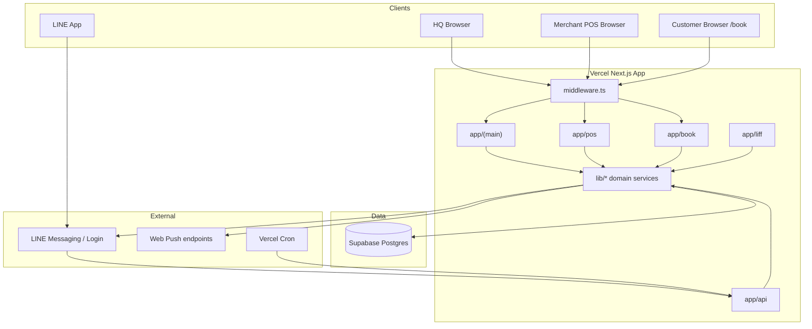

# Furmosa System Overview

**依據：** repository 現況（2026-07-25）  
**相關：** `README.md`, `DEPLOY.md`, `docs/BIBLES.md`, `docs/FURMOSA-OS-DOMAIN-SPEC-v1.md`

---

## 1. 系統解決什麼問題

Furmosa 將總部營運（寄賣、訂單、出貨、庫存、結算、換罐會員）與合作美容店日常任務（叫貨、預約、今天看板）收斂到同一套 Web 系統，取代分散的試算表與口頭／LINE 溝通。

核心價值：

- HQ 即時掌握訂單／出貨／寄賣表現  
- 店家可自助叫貨與管理美容預約  
- 顧客可公開預約店家時段，並透過 LINE 收到確認與提醒  
- 換罐序號／點數／美容券與合作店核銷  

---

## 2. 主要使用者

| 使用者 | 目標 | 主要介面 |
|--------|------|----------|
| HQ 營運／倉管／財務 | 建單、出貨、結算、換罐管理 | `app/(main)/*` |
| 寄賣／合作美容店 | 叫貨、看今天、確認預約 | `app/pos/*` |
| 飼主顧客 | 預約美容、LINE 存罐／兑點 | `/book/*`, LINE OA, `/liff/*` |
| 合作店店員（核銷） | 核對美容折價券 | `/store*`, `POST /api/coupons` |

---

## 3. 使用者完整旅程（摘要）

### 3.1 HQ 營運日

登入 `/login` → Dashboard KPI／今日任務 → 處理訂單／出貨佇列 → 寄賣店庫存與結算 → 換罐序號／會員 → （可選）審核 RestockRequest（`/restock-requests`）。

### 3.2 店家 POS

`/pos/login` → **今天**（待確認預約、下一位、補貨進度）→ **叫貨**（自己選／幫我配）→ **紀錄**；預約子流程：班表 → 列表 → 確認／改期／手動超約（`app/pos/appointments/*`）。

### 3.3 顧客預約（Booking MVP）

開啟 `/book/[merchantKey]` → 選日期／未滿時段／服務 → （可選）LIFF 綁 LINE → 送出 `requested` → 店家確認 → LINE「已確認」→ T−1d／T−2h 提醒（`lib/booking/notify.ts`, `reminders.ts`）。

### 3.4 LINE 換罐會員（現行）

Follow／選單 → 開戶（對話或 LIFF）→ 傳 8 位序號兑點 → 兑獎勵／美容券 → 合作店核銷（`lib/line/*`, `lib/jar-exchange/*`, `lib/coupons/*`）。

### 3.5 Round 3 旅程（規格有、程式未完整）

預約確認後 Refill／ECPay／帶空罐 — 見 Domain Spec；**本 repo 無 ECPay webhook 實作**（待確認是否另 repo）。

---

## 4. 系統邊界

**內：**

- HQ Admin、Merchant POS、公開預約頁、LINE webhook／LIFF、Cron、Web Push（HQ）

**外／未內建：**

- 官網電商前台（訂單可標記來源，但非本 app 完整 storefront）  
- ECPay／其他金流 gateway（文件有、code 無）  
- 美容師分班、訂金、CRM、AI 排程（明確不做／凍結）  
- 獨立 Notification Domain 表（PHASE TARGET 直接打 LINE helper）

---

## 5. 外部服務

| 服務 | 用途 | 設定依據 |
|------|------|----------|
| Supabase Postgres | 主資料庫 | `DEPLOY.md`, `DATABASE_URL`／`DIRECT_URL` |
| Vercel | Hosting + Cron | `vercel.json`, `DEPLOY.md` |
| LINE Messaging API | Bot 回覆／Push | `lib/line/config.ts`, `docs/LINE-SETUP.md` |
| LINE Login + LIFF | 會員頁／預約綁定 | `lib/line/liff-config.ts` |
| Web Push (VAPID) | HQ 新訂單通知 | `lib/web-push.ts` |
| Vercel Runtime Cache | 熱路徑快取 | `lib/runtime-cache.ts`（`@vercel/functions`） |

---

## 6. 前端／後端／資料庫／第三方關係

- **單一 Next.js 14 應用**：UI（RSC + Client Components）與 Server Actions／Route Handlers 同 repo。  
- **資料存取：** Prisma Client（`lib/prisma.ts`）→ Supabase Postgres。  
- **邊緣閘道：** `middleware.ts` 分流 HQ／POS／公開路徑。  
- **非同步：** Vercel Cron 呼叫 `/api/cron/*`；LINE Push／Reply 走外部 API。  

---

## 7. Mermaid — 系統架構

---

## 8. 文件與產品 Stage

見 `docs/BIBLES.md`：Stage 1–4（含 Booking Round 2）已完成標記；Stage 5 Refill／Payment／Jar ⏳。
